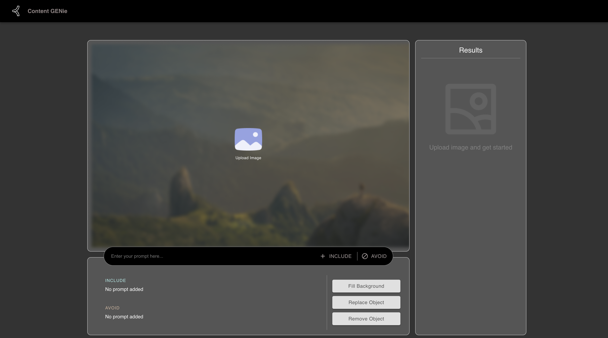
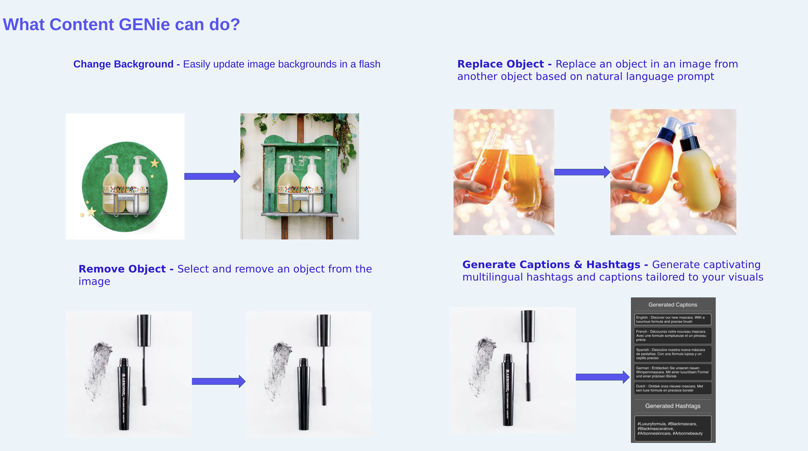
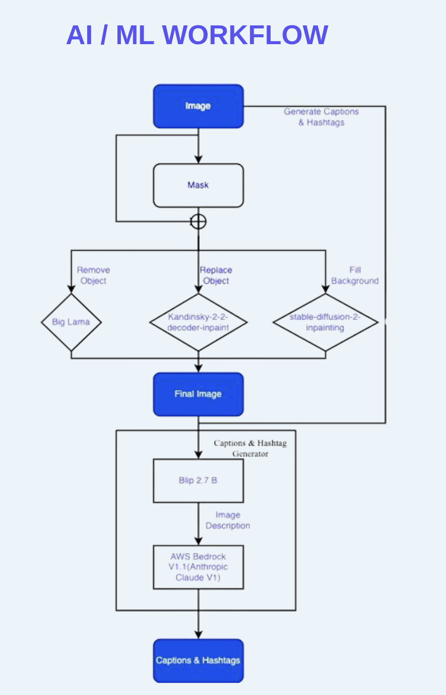

# Content GENie

> 🧠 AI-powered creative assistant for marketers — built as a hackathon proof of concept.

Content GENie is an AI-based tool designed to help marketing teams create engaging, brand-aligned content quickly and effortlessly. Developed as a hackathon PoC at Khoros, the project uses generative AI and image understanding to automate visual editing and generate multilingual captions and hashtags.

---

## ✨ Features

- **🖼️ Image Editing with Natural Language**
  - ✂️ Remove or replace objects
  - 🪄 Change image backgrounds
  - 🧽 Remove unwanted text or overlays

- **📢 Captions & Hashtags**
  - Generates catchy, multilingual hashtags & captions tailored to the image and brand tone

- **🎯 Smart Object Selection**
  - Uses the **Segment Anything Model (SAM)** to auto-select objects for editing with pixel accuracy

---

## 📽️ Demo

👉 check this link for the demo: https://drive.google.com/file/d/1evZIMx3Z06g9DjFRehXvrWbIu_ocGY__/view?usp=sharing

---
## 🧪 Sample Screenshots

### Landing page

### Features

### AI/ML Workflow

---

## 👥 Team

- Priyanka Barnwal  
- Shreyas SK  
- Jyotsana  
- Balachander Sivaraj  
- Vivek Grewal
